# 网络基础编程实验(Python3)

## 一、实验目的：

　　通过本实验，学习采用Socket（套接字）设计简单的网络数据收发程序，理解应用数据包是如何通过传输层进行传送的。  

## 二、实验内容：

​	Socket（套接字）是一种抽象层，应用程序通过它来发送和接收数据，就像应用程序打开一个文件句柄，将数据读写到稳定的存储器上一样。一个socket允许应用程序添加到网络中，并与处于同一个网络中的其他应用程序进行通信。一台计算机上的应用程序向socket写入的信息能够被另一台计算机上的另一个应用程序读取，反之亦然。

​	不同类型的socket与不同类型的底层协议族以及同一协议族中的不同协议栈相关联。现在TCP/IP协议族中的主要socket类型为流套接字（stream sockets）和数据报套接字（datagram sockets）。流套接字将TCP作为其端对端协议（底层使用IP协议），提供了一个可信赖的字节流服务。一个TCP/IP流套接字代表了TCP连接的一端。数据报套接字使用UDP协议（底层同样使用IP协议），提供了一个"尽力而为"（best-effort）的数据报服务，应用程序可以通过它发送最长65500字节的个人信息。一个TCP/IP套接字由一个互联网地址，一个端对端协议（TCP或UDP协议）以及一个端口号唯一确定。

### 2.1、采用TCP进行数据发送的简单程序（python）

TCP协议，传输控制协议（TCP）是一种面向连接的、可靠的、基于字节流的传输层通信协议。

TCP通信需要经过创建连接、数据传送、终止连接三个步骤。

TCP通信模型中，在通信开始之前，一定要先建立相关的链接，才能发送数据，类似于生活中打电话。

#### 1.客户端

创建客户端的步骤如下：

（1）导入socket模块

（2）创建TCP套接字

（3）建立连接(根据ip和port与服务端)

（4）发数据

（5）接收服务器响应

（6）关闭套接字

```python
#!/usr/bin/env python
# -*- coding:utf-8 -*-

import socket  # 导入socket模块，用于网络通信

# 设置要连接的服务器IP地址和端口号
# 127.0.0.1 是本机地址，9999是端口号
ip_port = ('127.0.0.1', 9999)

# 创建socket对象，使用默认的TCP协议
sk = socket.socket()
# 连接服务器
sk.connect(ip_port)

# 向服务器发送数据，需要先编码
sk.sendall('请求占领地球'.encode())

# 接收服务器的响应数据，最大接收1024字节
server_reply = sk.recv(1024)
# 解码并打印服务器的响应
print(server_reply.decode())

# 关闭连接
sk.close()
```


#### 2.服务端

创建服务端的步骤如下：

（1）导入socket模块

（2）创建TCP套接字

（3）绑定ip和port

（4）设置为被动监听模式，最大并发接收的数量是5(设置监听模式才能是服务器)

（5）等待接收连接请求，接收到的是一个元组 （客户端的socket对象，客户端地址)

（6）接收并打印客户端发送的数据，并向客户端发送响应数据

（7）关闭套接字

```python
#!/usr/bin/env python
# -*- coding:utf-8 -*-

import socket  # 导入socket模块，用于网络通信

# 设置服务器IP地址和端口号
# 127.0.0.1 是本机地址(回环地址)，9999是端口号
ip_port = ('127.0.0.1', 9999)

# 创建socket对象，使用默认的TCP协议
sk = socket.socket()
# 绑定IP地址和端口号
sk.bind(ip_port)
# 开始监听，参数5表示允许最大连接数
sk.listen(5)

# 服务器无限循环，持续等待客户端连接
while True:
    print('server waiting...')  # 打印等待信息
    # accept()会等待并返回一个客户端连接
    # conn是新的套接字对象，addr是连接客户端的地址
    conn, addr = sk.accept()

    # 接收客户端发送的数据，最大接收1024字节
    client_data = conn.recv(1024)
    # 解码并打印客户端发送的数据
    print(client_data.decode())
    # 向客户端发送响应数据
    conn.sendall('不要回答,不要回答,不要回答'.encode())

    # 关闭当前连接
    conn.close()
```


#### 3.运行结果

1.服务器处于循环等待中

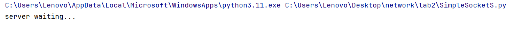

2.客户端向服务器发送`请求占领地球`,服务器收到消息后打印出数据内容

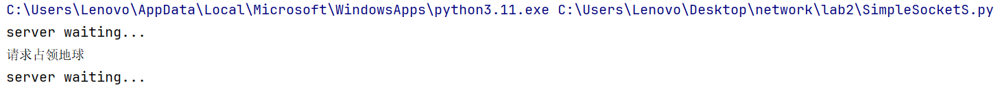

3.客户端收到来自服务器端的响应`不要回答`

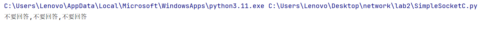

4.服务器继续循环等待

### 2.2、采用UDP进行数据发送的简单程序（python）

​	UDP——用户数据报协议，是一个无连接的简单的面向数据报的运输层协议。UDP不提供可靠性，它只是把应用程序传给IP层的数据报发送出去，但是并不能保证它们能到达目的地。由于UDP在传输数据报前不用在客户和服务器之间建立一个连接，且没有超时重发等机制，故而传输速度很快。它不属于连接型协议，因而具有资源消耗小，处理速度快的优点，所以通常音频、视频和普通数据在传送时使用UDP较多，因为它们即使偶尔丢失一两个数据包，也不会对接收结果产生太大影响。

#### 1.客户端

创建客户端的步骤如下：

（1）导入socket模块

（2）创建UDP套接字

（3）客户端根据ip和port循环向服务端发送请求

（4）关闭套接字

```python
#!/usr/bin/env python
# -*- coding:utf-8 -*-

import socket  # 导入socket模块，用于网络通信

# 设置目标服务器的IP地址和端口号
# 127.0.0.1 是本机地址，9999是端口号
ip_port = ('127.0.0.1', 9999)

# 创建UDP socket对象
# AF_INET 表示使用IPv4协议
# SOCK_DGRAM 表示使用UDP协议
# 0 表示使用默认协议
sk = socket.socket(socket.AF_INET, socket.SOCK_DGRAM, 0)

# 客户端循环发送数据
while True:
    # 获取用户输入的数据并去除两端空白
    inp = input('数据：').strip()
    # 如果输入'exit'则退出循环
    if inp == 'exit':
        break
    # 将数据编码并发送到服务器
    # sendto()方法需要指定目标地址
    sk.sendto(inp.encode(), ip_port)

# 关闭socket连接
sk.close()
```


#### 2.服务端

创建服务端的步骤如下：
（1）导入socket模块

（2）创建UDP套接字

（3）套接字绑定服务端ip和port

（4）服务端循环接收来自客户端的请求，解码并打印出接收到的数据

```python
#!/usr/bin/env python
# -*- coding:utf-8 -*-

import socket  # 导入socket模块，用于网络通信

# 设置服务器IP地址和端口号
# 127.0.0.1 是本机地址(回环地址)，9999是端口号
ip_port = ('127.0.0.1', 9999)

# 创建UDP socket对象
# AF_INET 表示使用IPv4协议
# SOCK_DGRAM 表示使用UDP协议
# 0 表示使用默认协议
sk = socket.socket(socket.AF_INET, socket.SOCK_DGRAM, 0)

# 绑定服务器地址和端口
sk.bind(ip_port)

# 服务器无限循环，持续接收数据
while True:
    # 接收UDP数据，最大接收1024字节
    # UDP不需要建立连接，直接接收数据
    data = sk.recv(1024)
    # 解码并打印接收到的数据
    print(data.decode())
```


#### 3.运行结果

（1）服务端处于无限循环

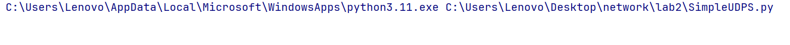

（2）客户端向服务端发送数据，`hi,zlz`

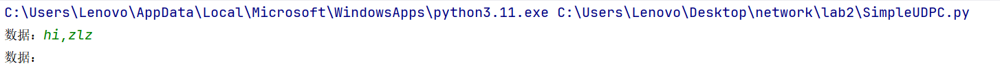

（3）服务端接收到客户端发送的数据

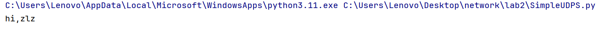

### 2.3、TCP与UDP使用套接字的异同

#### 1.创建套接字

参数1：family（给定的套接族）一般有两种重要参数

socket.AF_INET（用于服务器与服务器之间的网络通信）

socket.AF_INET6 （基于IPV6方式的服务器与服务器之间的网络通信）

参数2：type（套接字类型），也是一般两个类型

**socket.SOCK_STREAM**（基于TCP的流式socket通信）

**socket.SOCK_DGRAM**（基于UDP的数据报式socket通信）

#### 2.发送数据

UDP发送数据使用的函数为sendto，其格式为：

参数1：表示发送数据的内容

参数2：表示编码格式

参数3：表示目的地ip

参数4：表示目的地端口

#### 3.建立连接

UDP的服务端中不需要设置监听模式，也不需要建立连接，TCP需要不断监听，事先建立连接。

其余数据传输内容，与基于TCP的传输一致。

### 2.4、多线程\线程池对比

​	当一个客户端向一个已经被其他客户端占用的服务器发送连接请求时，虽然其在连接建立后即可向服务器端发送数据，服务器端在处理完已有客户端的请求前，却不会对新的客户端作出响应。

​	并行服务器：可以单独处理每一个连接，且不会产生干扰。并行服务器分为两种：一客户一线程和线程池。

​	每个新线程都会消耗系统资源：创建一个线程将占用CPU周期，而且每个线程都自己的数据结构（如，栈）也要消耗系统内存。另外，当一个线程阻塞（block）时，将保存其状态，选择另外一个线程运行，并在上下文转换（context switch）时恢复阻塞线程的状态。随着线程数的增加，线程将消耗越来越多的系统资源。这将最终导致系统花费更多的时间来处理上下文转换和线程管理，更少的时间来对连接进行服务。那种情况下，加入一个额外的线程实际上可能增加客户端总服务时间。

​	我们可以通过限制总线程数并重复使用线程来避免这个问题。与为每个连接创建一个新的线程不同，服务器在启动时创建一个由固定数量线程组成的线程池（thread pool）。当一个新的客户端连接请求传入服务器，它将交给线程池中的一个线程处理。当该线程处理完这个客户端后，又返回线程池，并为下一次请求处理做好准备。如果连接请求到达服务器时，线程池中的所有线程都已经被占用，它们则在一个队列中等待，直到有空闲的线程可用。

#### （1）多线程

​	与单线程不同之处在于每次建立起一个新的连接时，就使用threading模块创建一个新的线程，向新的线程中传入该客户端套接字的信息，并保持通信，同时该线程需要通过thread.setDaemon(True)设置为守护主线程。

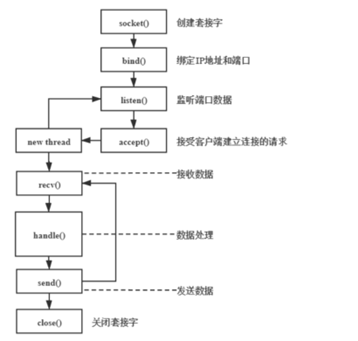

##### 客户端

```python
import socket  # 导入socket模块，用于网络通信
import threading  # 导入threading模块，用于多线程编程

# 定义服务器的IP地址和端口
ip_port = ('127.0.0.1', 9998)

# 定义客户端的工作函数
def work(x):
    # 创建一个TCP套接字
    sk = socket.socket(socket.AF_INET, socket.SOCK_STREAM)
    # 连接到服务器
    sk.connect(ip_port)
    message = '拔尖班' + str(x) + '号签到'
    sk.send(message.encode())
    print('客户端' + str(x) + '发送签到请求成功\n')
    data = sk.recv(1024).decode()
    print('客户端' + str(x) + '成功签到，接收消息:' + data + '\n')
    # 关闭套接字连接
    sk.close()
    print('客户端' + str(x) + '断开连接成功\n')

# 创建20个线程，模拟20个客户端同时签到
for i in range(20):
    # 创建一个线程，目标函数是work，参数是i
    thread = threading.Thread(target=work, args=(i,))

    # 启动线程
    thread.start()
```


​	客户端的实现基于多线程。work为线程的工作函数，其核心功能为创建客户端套接字，使该套接字与服务器建立TCP连接，向服务器的套接字发送数据，接受服务端套接字传输的数据。客户端基于多线程实现数据发送可以有效地模拟真实生产环境下，不同PC主机向服务器发送数据的状态，从而对多线程的工作效果加以分析。

##### 服务端

```python
import socket  # 导入socket模块，用于网络通信
import threading  # 导入threading模块，用于多线程编程

# 定义服务器的IP地址和端口
ip_port = ('127.0.0.1', 9998)
# 定义处理客户端请求的函数
def work(conn, addr):
    # 接收客户端发送的消息
    data = conn.recv(1024).decode()  # 从客户端接收最多1024字节的数据，并解码为字符串
    print('服务器接收来自:\t' + str(addr) + '的信息,内容为:' + data + '\n')
    conn.send('你已签到'.encode())  # 发送"你已签到"消息到客户端
    print('服务器向' + str(addr) + '回复消息\n')
    conn.close()
    print('服务器与客户端:\t' + str(addr) + '的连接关闭\n')
if __name__ == '__main__':
    sk = socket.socket(socket.AF_INET, socket.SOCK_STREAM)
    sk.bind(ip_port)    # 绑定服务器的IP地址和端口
    # 开始监听客户端连接，最多允许5个客户端排队
    sk.listen(5)
    print('server waiting...')  # 打印服务器等待连接的状态
    # 服务器主循环，持续等待客户端连接
    while True:
        # 接受客户端连接
        conn, addr = sk.accept()  # 阻塞等待，直到有客户端连接
        print(f'客户端:\t\t{addr}连接成功\n')        # 打印客户端连接成功的消息
        thread = threading.Thread(target=work, args=(conn, addr), daemon=True)
        # 启动线程
        thread.start()
```

##### 运行结果

- 客户端：

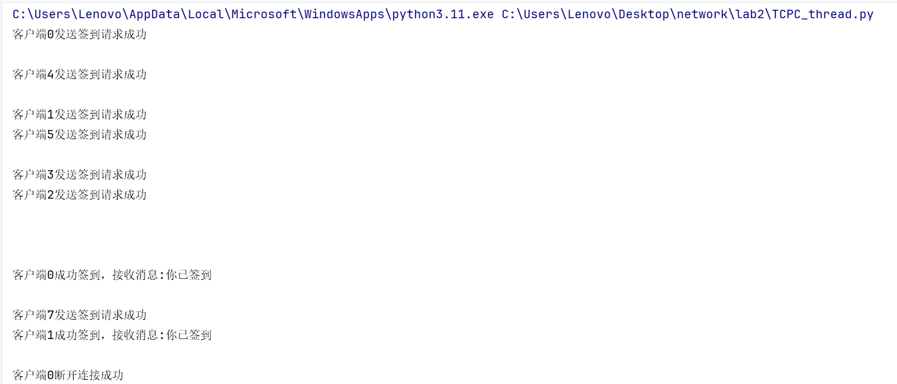

- 服务器端

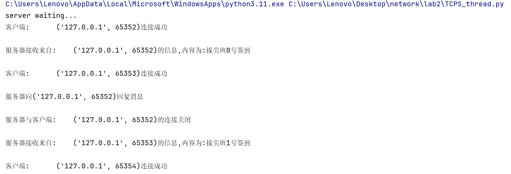

#### （2）线程池

​	使用`ThreadPoolExecutor`来实例化线程池对象。传入`max_workers`参数来设置线程池中最多能同时运行的线程数目。

​	使用`submit`函数来提交线程需要执行的任务（函数名和参数）到线程池中，并返回该任务的抽象对象。`submit()`不是阻塞的，而是立即返回。通过`submit`函数返回的任务抽象对象，能够使用其`done()`方法判断任务是否结束。

​	通过`ThreadPoolExecutor()`创建了一个最大工作线程数为10的线程池。

​	若将服务器端线程池最大工作线程数设置为比客户端请求线程总数小，由于线程池只会维护最大工作线程数的线程进行工作，因此，当线程池的线程已满时，后到的任务需要排队等待线程池对其进行工作调度。


##### 客户端

​	和多线程的客户端完成相同的功能，所以线程池的客户端代码与多线程的相同。

##### 服务端

```python
import socket

from concurrent.futures import ThreadPoolExecutor

ip_port=('127.0.0.1',9997)

# 定义处理客户端请求的函数
def work(conn, addr):
    # 接收客户端发送的消息
    data = conn.recv(1024).decode()  # 从客户端接收最多1024字节的数据，并解码为字符串
    print('服务器接收来自:\t' + str(addr) + '的信息,内容为:' + data + '\n')
    conn.send('你已签到'.encode())  # 发送"你已签到"消息到客户端
    print('服务器向' + str(addr) + '回复消息\n')
    conn.close()
    print('服务器与客户端:\t' + str(addr) + '的连接关闭\n')

if __name__ == '__main__':
    sk = socket.socket(socket.AF_INET, socket.SOCK_STREAM)
    sk.bind(ip_port)    # 绑定服务器的IP地址和端口
    # 开始监听客户端连接，最多允许5个客户端排队
    sk.listen(5)
    print('server waiting...')  # 打印服务器等待连接的状态
    # 服务器主循环，持续等待客户端连接
    pool=ThreadPoolExecutor(max_workers=10)
    while True:
        conn, addr = sk.accept()
        pool.submit(work, conn, addr)
        print(f'客户端:\t\t{addr}连接成功')
```

##### 运行结果

客户端：

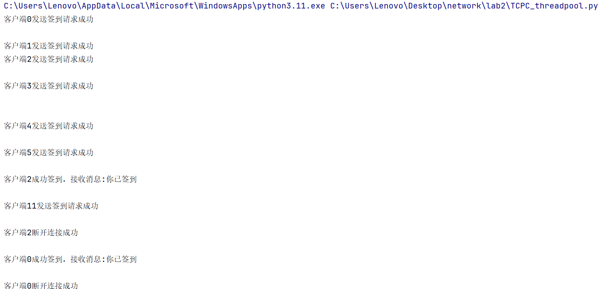

服务端：


#### （3）多线程/线程池的比较

（1）线程池是在程序运行开始，创建好的n个线程，并且这n个线程挂起等待任务的到来。而多线程是在任务到来得时候进行创建，然后执行任务。

（2）线程池中的线程执行完之后不会回收线程，会继续将线程放在等待队列中；多线程程序在每次任务完成之后会回收该线程。

（3）由于线程池中线程是创建好的，所以在效率上相对于多线程会高很多。

（4）线程池也在高并发的情况下有着较好的性能；不容易挂掉。多线程在创建线程数较多的情况下，很容易挂掉。

总结：

- 多线程
  - 特点：为每个连接创建新线程，线程生命周期由程序控制。
  - 优点：实现简单，适合少量并发。
  - 缺点：线程过多时资源消耗大，可能导致性能下降。
- 线程池
  - 特点：预先创建固定数量的线程，任务完成后线程复用。
  - 优点：减少线程创建和销毁开销，适合高并发场景。
  - 缺点：实现稍复杂，需管理线程数量。
- **使用场景**：多线程适合小型应用，线程池适合大规模服务器程序。

### 2.5、一个简单的文件传输助手	

​	使用TCP连接，通过选定文件路径，在客户端与服务端进行文件传输

协议结构：

1. **头部**：包含文件名（字符串）和文件大小（整数），使用JSON编码。
2. **数据**：文件内容的二进制数据。

#### 客户端

提供文件路径，文件内容和文件大小

```python
import socket
import os

ip_port = ('127.0.0.1', 9996)

while True:
    try:
        # Create a new socket for each file transfer attempt
        sk = socket.socket(socket.AF_INET, socket.SOCK_STREAM)
        sk.connect(ip_port)

        path = input('path: ')  # Input file path
        if not os.path.exists(path):  # Check if file exists
            print("文件不存在，请重新输入路径！")
            continue
        if path.lower() == 'quit':  # Allow user to exit by typing 'quit'
            print("退出程序")
            break

        file_name = os.path.basename(path)  # Get file name
        file_size = os.stat(path).st_size  # Get file size
        # Construct file information string in the format "filename|filesize"
        Informf = f"{file_name}|{file_size}"
        sk.send(Informf.encode())  # Send file information to server

        # Wait for server confirmation
        confirmation = sk.recv(1024).decode()
        print(f"服务器确认: {confirmation}")

        print("准备上传文件...")  # Print preparing to upload message
        send_size = 0  # Track sent file size
        with open(path, 'rb') as f:  # Open file in binary read mode
            while send_size < file_size:
                # Read remaining bytes if less than 1024 bytes are left
                if file_size - send_size < 1024:
                    data = f.read(file_size - send_size)
                else:
                    data = f.read(1024)  # Read 1024 bytes at a time
                sk.send(data)  # Send file content to server
                send_size += len(data)  # Update sent size
                print(f"已发送: {send_size}/{file_size} 字节")  # Print progress
            print('文件上传完成！')  # Print upload complete message

        # Wait for server to confirm file upload completion
        sk.shutdown(socket.SHUT_WR)  # Signal end of sending
        final_confirmation = sk.recv(1024).decode()
        print(f"服务器最终确认: {final_confirmation}")

        print("文件上传成功！")
        break  # Exit loop after successful upload

    except ConnectionRefusedError:
        print("无法连接到服务器，请检查服务器是否运行！")
        break
    except Exception as e:
        print(f"发生错误: {e}")
        continue
    finally:
        sk.close()  # Ensure socket is closed

print("客户端已退出")
```


#### 服务端

逐步接收客户端传输过来的数据

```python
import socketserver
import os


class MyServer(socketserver.BaseRequestHandler):
    def handle(self):
        base_path = r'C:\Users\Lenovo\Desktop\network\lab2\file_save'  # 文件保存的目录
        conn = self.request  # 获取客户端连接
        print('connected...')  # 打印连接信息
        # 接收文件名和文件大小
        pre_data = conn.recv(1024).decode()  # 接收客户端发送的文件名和文件大小
        file_name, file_size = pre_data.split('|')  # 解析文件名和文件大小
        file_size = int(file_size)  # 将文件大小转换为整数
        # 确认接收准备
        conn.sendall(f"{file_name}已发送".encode())  # 向客户端发送确认消息
        # 创建保存文件的路径
        file_dir = os.path.join(base_path, file_name)
        # 确保目录存在
        os.makedirs(base_path, exist_ok=True)
        # 打开文件准备写入
        with open(file_dir, 'wb') as f:
            recv_size = 0  # 已接收的文件大小
            while recv_size < file_size:  # 循环接收文件内容
                data = conn.recv(1024)  # 接收文件内容
                f.write(data)  # 将接收到的内容写入文件
                recv_size += len(data)  # 更新已接收的文件大小
                print(f"已接收: {recv_size}/{file_size} 字节")  # 打印接收进度

        print('upload successed.')  # 打印上传成功信息
        
# 创建多线程TCP服务器
instance = socketserver.ThreadingTCPServer(('127.0.0.1', 9996), MyServer)
instance.serve_forever()  # 启动服务器
```

#### 运行结果

​	首先将想要传输的文件放到file_send文件夹中，服务端读取文件后会将其存储到file_save文件夹中


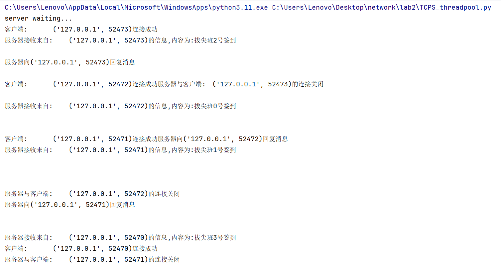

## 三、实验总结

​	通过本次实验，我掌握了使用socket实现TCP和UDP通信的基本方法，理解了两者的核心差异：TCP提供可靠传输，适合文件传输等场景；UDP速度快但不可靠，适合实时应用。此外，我学习了多线程和线程池的设计，多线程通过为每个连接分配线程提升并发能力，而线程池通过线程复用优化了资源利用，适用于高负载环境。在文件传输中，我设计了简单的协议并加入错误处理，提升了程序健壮性。这次实验让我深刻体会到网络编程中性能与可靠性的权衡，以及并发处理的实际应用价值。